# Components

How the pieces compose. The core is deliberately **domain-agnostic**
([Principle IV](trust-model.md#compliance-gates)) — it knows only Conway
transactions, signatures, time, and the chain, never a consumer's domain.

```mermaid
flowchart TB
    subgraph HTTP["HTTP /v1 (contract-first, CORS, credential-free)"]
        SV[Server<br/>hand-routed WAI/warp]
    end
    subgraph CORE["Pure coordination core (no chain backend leaks in)"]
        PUB[Publish<br/>fee gate + admission]
        WIT[Witness<br/>Ed25519 verify]
        FIL[Filter<br/>default-deny predicates]
        TAG[FeeTag<br/>metadata codec]
    end
    subgraph SIDE["Side-effecting edges"]
        CH[Chain<br/>N2C: phase-1 + reads]
        IDX[FeeIndexer<br/>chain-follower]
        LIV[Liveness<br/>expiry monitor]
        ST[(Store<br/>RocksDB)]
    end
    N[(cardano-node)]

    SV --> PUB & WIT & FIL
    PUB --> TAG
    PUB --> CH
    PUB --> ST
    IDX --> TAG
    IDX --> CH
    IDX --> ST
    CH --- N
    IDX --- N
    LIV --> CH
    LIV --> ST
    WIT --> ST
    FIL --> ST
    style CORE fill:#0d2818
    style SIDE fill:#1a1a2e
```

## Module map

| Module | Responsibility | Constitution tie | Ticket / status |
|--------|----------------|------------------|------------------|
| `Server` | Hand-routed WAI/warp app; the `/v1` surface; CORS; wires the store + node + background monitors at startup | VII (backend, no UI) | M1 core |
| `Chain` | N2C access behind an interface: live **phase-1 pre-flight** and chain reads; no chain backend leaks into the pure core | V, VI | M1 core |
| `Store` (+ `Store/`) | Durable RocksDB persistence: entries, witnesses, status — **and the rollback-aware fee-payment / allowance model** | VII (durable to restart) | allowance model = [#29](https://github.com/lambdasistemi/cardano-multisig/issues/29) ✅ **merged** (PR #34) |
| `FeeTag` | The pinned **metadata codec** — `encode/decodeFeeTag` over ledger `Metadatum` (label `9721`), golden-tested against real `cardano-cli` CBOR | VI (no api umbrella) | [#28](https://github.com/lambdasistemi/cardano-multisig/issues/28) ✅ **merged** (PR #33) |
| `FeeIndexer` | Background **chain-follower**: watches the fee address, decodes tags, records allowances **and malformed/untagged payments**, handles rollbacks + confirmation depth | III, Economic | [#30](https://github.com/lambdasistemi/cardano-multisig/issues/30) ✅ **merged** (PR #36) |
| `Publish` | The admission gate: quote, `requiredFee`, and the three publish gates (phase-1, bounded TTL, paid fee); admits on the indexed allowance, emits named reasons, and serves `fee-status` (**datum path removed**) | I, III, V, Economic | rewrite = [#31](https://github.com/lambdasistemi/cardano-multisig/issues/31) ✅ **merged** (PR #37) |
| `Witness` | Ed25519 witness verification against the body hash; required-signer membership | I, VIII | M1 core |
| `Filter` | The **default-deny** inbox predicates: `trust-ordered` (canonical) + `roster-open` (bootstrap); self-signed policy storage | III | M1 core |
| `Liveness` | Supervised async monitor: continuous staleness/expiry detection, auto-sweep of passed-TTL entries | V | M1 core |

## The #26 epic in this map

The [fee-discovery redesign](fee-discovery.md) (#26) was delivered by a chain
of children — **all merged; the epic is complete** — near-sequential because the
later ones consume the earlier ones:

```mermaid
flowchart LR
    T28["#28 FeeTag<br/>metadata codec ✅"] --> T29["#29 Store<br/>allowance model ✅"]
    T29 --> T30["#30 FeeIndexer<br/>chain-follower ✅"]
    T29 --> T31["#31 Publish rewrite<br/>+ fee-status ✅"]
    T30 --> T32["#32 devnet<br/>publish smoke ✅"]
    T31 --> T32
    classDef done fill:#1b4332;
    class T28,T29,T30,T31,T32 done;
```

- **#28 FeeTag** (PR #33) — the agreement surface: the exact on-chain bytes both
  the indexer and the publish gate depend on.
- **#29 Store** (PR #34) — the rollback-aware allowance model the indexer writes
  and the publish gate reads.
- **#30 FeeIndexer** (PR #36) — the chain-follower that populates allowances and
  records malformed/untagged payments.
- **#31 Publish** (PR #37) — retired the datum gate, admits on the allowance,
  serves the `fee-status` evidence query. The datum path and `plutus-ledger-api`
  are now gone entirely.
- **#32 devnet publish smoke** (PR #38) — the mandatory live-boundary test, now a
  **required CI job**: it boots a forging Conway devnet and drives a real
  metadata-tagged payment through `fee_not_seen → fee_unconfirmed →
  ready_to_publish → 201 → receipt`, so a mock-green publish path can never merge
  again (the [datum DOA](fee-discovery.md#alternatives-considered) is what it
  guards against).

## Technology constraints

- **Haskell + Nix flake**, matching the `cardano-tx-tools` / `amaru-treasury-tx`
  toolchain; crypto and phase-1 reused from those, never forked, never
  delegated to JavaScript.
- **Chain access** is N2C to a local `cardano-node` by default, behind an
  interface additional sources may implement.
- **State** is an explicit RocksDB persistence layer, swappable behind an
  interface, durable across restart.
- **API** is contract-first: the checked-in
  [OpenAPI 3.1 document](https://github.com/lambdasistemi/cardano-multisig/blob/main/openapi/v1.yaml)
  is the source of truth and the interop standard operators implement.
