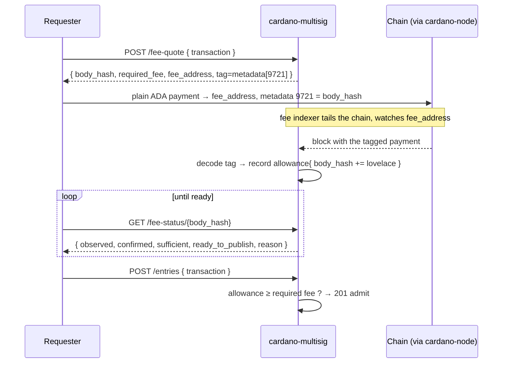

# Fee discovery

This page answers a question the [economic model](fees.md) leaves open:
**how does the service actually *see* your payment, bind it to your request,
and let you confirm it was seen before you publish?**

This is the design settled in
[issue #26](https://github.com/lambdasistemi/cardano-multisig/issues/26) and
delivered by its child tickets. It replaces an earlier approach that was
**proven broken on a live devnet** — the history is instructive and is kept
below.

## The mechanism, end to end



1. **Quote.** `POST /v1/fee-quote` with the unsigned transaction returns the
   `body_hash` (the request id), the `required_fee_lovelace`, the published
   `fee_address`, and the **tag** to attach.
2. **Pay.** Make an **ordinary ADA payment** (no datum) to `fee_address`,
   carrying **transaction metadata** that names the body hash. Any wallet or
   `cardano-cli --metadata-json` can do this.
3. **Discover.** A background **fee indexer** (a chain-follower) watches the
   fee address, reads each tagged payment's metadata, and records an
   **allowance** keyed by body hash.
4. **Confirm (the evidence query).** `GET /v1/fee-status/{body_hash}` tells
   you whether the service has *seen* your payment and whether it is
   *sufficient and confirmed* — so you never publish blind.
5. **Publish.** `POST /v1/entries` admits the entry when the indexed
   allowance covers the required fee.

## The pinned metadata tag

The tag is a **protocol-wide constant**, identical for every operator (clients
treat operators as interchangeable), pinned in
[`openapi/v1.yaml`](https://github.com/lambdasistemi/cardano-multisig/blob/main/openapi/v1.yaml):

```json
{ "9721": { "body_hash": "<64-lowercase-hex body hash>" } }
```

- metadatum **label `9721`**;
- value is a single-key map, `body_hash` → the 64-char lowercase hex body
  hash (64 hex chars = 64 bytes, within the metadata string limit; encoded as
  a text string, exactly what `cardano-cli --metadata-json-schema no-schema`
  emits).

!!! note "Why the format is pinned this precisely"
    The failure mode we are engineering *out* is: **you pay, and the service
    silently doesn't accept it, with no way to tell you why.** A published,
    exact format plus [named rejection reasons](#named-rejection-reasons)
    means a wrong payment is always explained.

## The allowance model

The indexer does not store a running total blindly — it stores **individual
tagged payments**, keyed by `(body_hash, txin)`:

```
{ body_hash, txin, lovelace, block_slot }
```

Per-payment records (not just a sum) are what make **rollbacks** correct.

- **Sum, don't replace.** The allowance for a body hash is the *sum* over its
  tagged payments. A dust payment tagged with the same body hash can only
  *add*, never grief.
- **Confirmation depth.** A payment counts toward the allowance only once it
  is **final** — `block_slot ≤ tip − depth`. A shallow (1-block) payment is
  reported as *pending*, not admitted, so a rollback can't admit-then-orphan.
- **Rollback = revoke.** On a chain `RollBackward`, the indexer drops every
  payment in orphaned blocks and re-derives the allowance. A double-spent or
  orphaned fee payment therefore makes `fee-status` flip back to not-ready —
  the service defends itself automatically.

## The evidence query: `GET /fee-status/{body_hash}`

A **read-only dry-run of the fee gate** against the indexed allowance:

```json
{ "observed": true, "confirmed": true, "sufficient": true,
  "ready_to_publish": true, "paid_lovelace": 1024000,
  "required_lovelace": 1024000, "confirmations": 12, "reason": null }
```

It is **optimistic / point-in-time** — publish remains the authoritative gate
— but once a payment is confirmed deep enough it is stable, and this is the
evidence you use to know publishing will succeed. The requester **never
pushes a publish before the fee is observed.**

### Named rejection reasons {#named-rejection-reasons}

Surfaced by both `fee-status` and the publish `402`, so a payer is never left
guessing:

| Reason | Meaning |
|--------|---------|
| `fee_not_seen` | no tagged payment observed yet |
| `fee_unconfirmed` | seen, but below the confirmation-depth threshold |
| `fee_insufficient` | total tagged lovelace < required |
| `fee_metadata_malformed` | payment reached the address but the tag is missing / wrong label / undecodable |

## Why metadata, and why an indexer

Two facts force this shape:

- **Metadata solves min-UTxO.** A plain payment with tx-level metadata has a
  normal min-UTxO, so the exact (≈1 ADA) fee is payable — and it is
  wallet-native.
- **Metadata is not in the UTxO set.** It lives in the block body, *not* in
  any `TxOut`, so it is **not readable via the on-demand LocalStateQuery
  path.** The only way to read it is to **follow the chain** — hence the fee
  indexer. This is why the service runs a chain-follower at all.

## Alternatives considered {#alternatives-considered}

The current design is a settled choice among three, and it is worth knowing
what was rejected and why — this is where to push back.

=== "✅ Metadata + indexer (M1)"
    Self-contained, zero-trust, zero-validator, one node you already run (the
    node is already needed for phase-1 pre-flight). Cost: a small stateful
    chain-follower with rollback handling. **Chosen for M1.**

=== "❌ Inline datum tag (proven DOA)"
    The original approach tagged the fee *output* with an inline datum
    `Data.B(bodyHash)`. Proven **unsatisfiable on a live Conway devnet**:

    - **min-UTxO > fee.** A datum-carrying output needs ≈1.2 ADA, above the
      ≈1 ADA base fee — the advertised fee is unpayable
      (`BabbageOutputTooSmallUTxO`).
    - **Encoding unproducible.** Wallets and `cardano-cli` emit
      `Data.Map {"bytes": …}`, not `Data.B(<raw>)` → a tag mismatch. The
      exact `Data` shape is an undocumented, wallet-hostile contract.

    A datum on a pubkey output is also a category error (datum = script-spend
    data, not a payment memo). This is the failure the mandatory **devnet
    publish smoke** now exists to prevent from ever recurring.

=== "❌ Per-request address (rejected)"
    Derive a fresh fee address per request; discover the payment by querying
    that address via LocalStateQuery — no indexer. Rejected because it gives
    only **point-in-time** evidence (LSQ reflects the current UTxO set, not a
    durable "I saw it"), needs HD-address management, and the durable
    allowance record we want is exactly what the indexer provides.

## The M2 direction (deferred, staged to be grilled)

There is a more ambitious, more *marketable* design on the roadmap —
[issue #27](https://github.com/lambdasistemi/cardano-multisig/issues/27) —
that could **retire the indexer** by pushing the payment proof to the client:

- **Subbit-style payment channels** — per-request payment as an off-chain
  signed voucher; nothing to index. Cost: it is an on-chain *validator*
  (collides with the zero-validator invariant) and adds a channel lifecycle;
  only pays off at high request volume.
- **Client-supplied CSMT inclusion proofs** — the requester proves the
  payment UTxO exists against a trusted `utxo-csmt` root; no per-address
  follower. Cost: "no follower" is really *relocation* — the service needs a
  trusted, current root, and this reopens the tag-in-output decision.

Both are **explicitly M2** and gated on real need. See #27 for the full
grilling.
