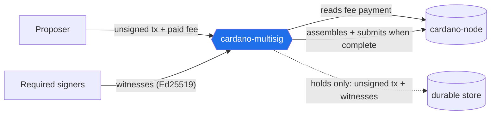

# Architecture

This section explains **what `cardano-multisig` is, why it is shaped the way
it is, and where the design is deliberately load-bearing** — so you can
understand it and push back before Milestone 1 is released.

The [constitution](https://github.com/lambdasistemi/cardano-multisig/blob/main/.specify/memory/constitution.md)
is the governing document; these pages are the reasoned walkthrough of it,
kept honest about the decisions that are *closed on purpose* and the ones
still worth challenging.

## One sentence

A **permissionless, keyless, zero-on-chain-code backend** that collects
witnesses over a Conway transaction until it is fully signed, then submits
it — charging a small non-refundable on-chain fee per request so a public
instance cannot be spammed.

## The mental model that matters

It is **not a smart contract**, and it is **not a custodian**. It is a
**coordinator**: it hosts an *unsigned* transaction and the *witnesses*
gathered for it, and it relays. It never holds funds, never holds a key over
user funds, and runs **no on-chain validator** at all.

Everything else follows from taking that seriously:

- The proposer **need not be a signer** — a valid proposal is one that is
  *paid for*, not one that is *enrolled*. A malicious proposal is harmless:
  no honest signer signs a transaction they have not verified, and no party
  can forge a witness.
- The service's job is **verify and relay**. It checks signatures, assembles
  the fully-witnessed transaction, and broadcasts it. It never signs.
- A vanished operator costs at most **re-collection** of a request — never
  funds, never authority — because witnesses are re-signable and the
  unsigned transaction is re-publishable.

## The eight load-bearing decisions

Each links to where it lives in these pages. The ones marked ⚠ are the
places to aim your pushback first — they are closed *on purpose* and each
closes off an alternative you might otherwise want.

| # | Decision | Where |
|---|----------|-------|
| 1 | **No accounts** — authorization is a fact checked per request, never an identity stored | [Trust model](trust-model.md) |
| 2 | ⚠ **Zero on-chain validators** — no Plutus, no minting policy, nothing to deploy or audit | [Trust model](trust-model.md) |
| 3 | ⚠ **Non-refundable fee** — prices the *reservation*, not the usage; a refund would reintroduce a validator | [Fees](fees.md) |
| 4 | **Validity-weighted fee** — `base + rate·(invalidHereafter − tip)` prices the real cost driver (monitoring) | [Fees](fees.md) |
| 5 | ⚠ **Metadata-tagged payment + a fee indexer** — how the service *discovers* your payment | [Fee discovery](fee-discovery.md) |
| 6 | **Default-deny filter** is the sole inbox defence; publication is open | [Lifecycle](lifecycle.md) |
| 7 | **Gated entry, self-cleaning queue** — phase-1 + bounded TTL at admission; auto-expiry, no delete endpoint | [Lifecycle](lifecycle.md) |
| 8 | ⚠ **No off-operator durability** — durable to *restart*, not to an operator vanishing; recover by re-collection + multi-homing | [Trust model](trust-model.md) |

## Where to push back

If you only challenge a few things before M1, challenge these — they are the
hinges the rest hangs on:

1. **Non-refundability (#3).** You pay to *try*, not to *succeed*; early
   resolution forfeits the remainder. This is what keeps the chain
   validator-free. Is "pay-per-attempt" acceptable UX, or does the lack of a
   refund need a mitigation? See [Fees](fees.md#non-refundability).
2. **Metadata + indexer over a light-client proof (#5).** M1 runs a
   chain-follower to discover payments. The lighter, more marketable
   alternative (client-supplied proofs, Subbit channels) is deferred to
   [M2](https://github.com/lambdasistemi/cardano-multisig/issues/27) — is
   deferring it right? See [Fee discovery](fee-discovery.md#alternatives-considered).
3. **No off-operator durability (#8).** If an operator disappears mid-ceremony
   you re-collect. Is re-collection + multi-homing genuinely enough for your
   use case, or is there a slow signing ceremony where it is not? See
   [Trust model](trust-model.md#no-off-operator-durability).

## Read next

- **[Trust model](trust-model.md)** — authorization, the zero-validator
  boundary, no custody, and the threat model.
- **[Fees & the economic model](fees.md)** — why the fee is shaped the way it
  is, and the operator market.
- **[Fee discovery](fee-discovery.md)** — how the service sees your payment:
  the metadata tag, the indexer, the allowance, and the `fee-status` query.
- **[Request lifecycle](lifecycle.md)** — quote → pay → publish → witness →
  submit, gate by gate.
- **[Components](components.md)** — the module map and how the pieces compose.
