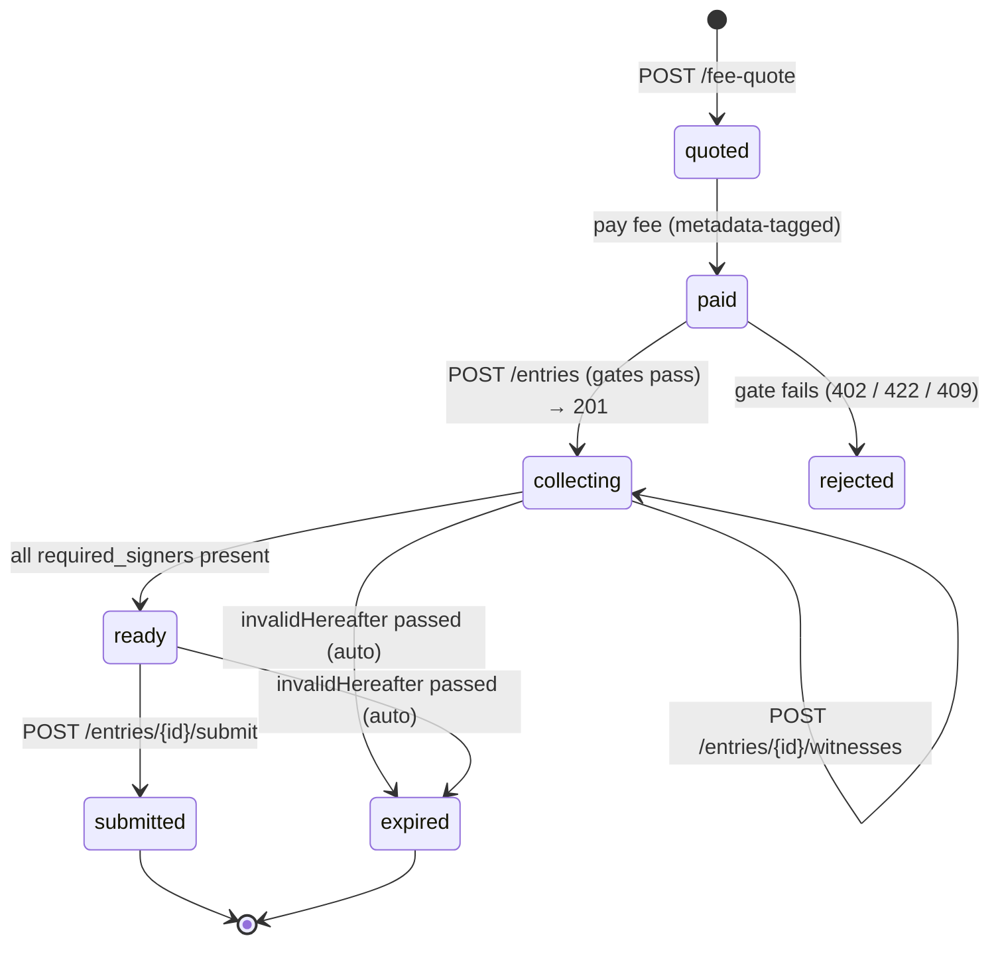

# Request lifecycle

The full path of a transaction through the service, gate by gate. Endpoints
are the [`/v1` contract](../api-v1.md); the fee mechanics are on the
[Fee discovery](fee-discovery.md) page.

## 1. Quote

`POST /v1/fee-quote { transaction }` → the `body_hash` (the request id), the
`required_fee_lovelace`, the `fee_address`, and the metadata `tag`. No auth.
The quote is [point-in-time](fees.md#point-in-time-not-a-forever-price).

## 2. Pay & confirm

Pay the metadata-tagged fee, then poll `GET /v1/fee-status/{body_hash}` until
`ready_to_publish`. See [Fee discovery](fee-discovery.md). This step means you
publish **only after** the service has observed your fee.

## 3. Publish — the three admission gates

`POST /v1/entries { transaction }` admits an entry **only if all three hold**
([Principle V](trust-model.md), "gated entry"):

1. **Phase-1 pre-flight (live).** The transaction could be submitted *right
   now* given a complete roster — a real Conway phase-1 validation against the
   node: all inputs resolve, the validity interval contains the current tip,
   value is conserved. Reuses the validator from
   [`cardano-tx-tools`](https://github.com/lambdasistemi/cardano-tx-tools),
   never reimplemented. → `422` on failure.
2. **Bounded TTL.** The body carries a **finite** `invalidHereafter`; an
   unbounded one is rejected, and one more than the configured horizon
   (default ≈2 epochs / ≈10 days ahead of tip) is rejected. → `422`.
3. **Paid fee.** The indexed allowance is on-chain, tagged for this body hash,
   confirmed, and covers `base + rate·(invalidHereafter − tip)`
   (**pay-before-work**). → `402` with a
   [named reason](fee-discovery.md#named-rejection-reasons).

Duplicate body hash → `409`. The publisher **need not be a required-signer** —
publication is open to any paying proposer.

!!! note "Why pay-before-work"
    The service is never made to pre-flight, store, and monitor an entry it
    has not been paid for. The fee gate runs before any durable work.

## 4. Witness collection — the default-deny inbox {#witness-collection}

Required signers discover what they must sign and add witnesses.

- **`GET /v1/entries?signer=…&predicate=…`** — the signer-controlled,
  **default-deny** query ([Principle III](trust-model.md), the *sole* inbox
  defence). Two predicates:
    - **`trust-ordered`** (canonical, default-deny): surface an entry only
      once it *already carries a witness from a co-signer on the signer's
      allowlist* — "show me only entries already signed by someone I trust."
      Trust flows with signing order; a rogue proposer never reaches an honest
      inbox until a trusted co-signer has vouched by signing first.
    - **`roster-open`** (bootstrap): surface entries where the signer is on
      the roster regardless of existing witnesses — the first-mover predicate,
      accepting more noise so the very first signature can start the chain (a
      zero-witness entry would otherwise be invisible to everyone).
- **`PUT /v1/signers/{vkeyhash}/filter`** — store a signer's default
  predicate, **authorized by that key's signature**. Nobody can set another
  signer's policy.
- **`POST /v1/entries/{id}/witnesses`** — add a witness. Self-securing: the
  signature must verify over the body hash and the key must be in
  `required_signers`; an invalid or non-required witness is rejected (`422`),
  a duplicate is `409`.

!!! warning "The filter is the *only* inbox defence"
    The service MUST NOT protect a signer's inbox by gating *who* may publish
    — publication is paid and open; attention is filtered. Removing or
    weakening the default-deny filter is a constitution violation, not a
    tuning knob.

## 5. Submit

Once every `required_signers` key has witnessed (status `ready`),
`POST /v1/entries/{id}/submit` assembles the fully-witnessed transaction,
broadcasts it, and persists a **receipt** (`GET …/receipt`). No auth in M1: a
fully-witnessed transaction is broadcastable by anyone, so submission
authorization is deferred as operational policy, not an M1 gate.

## Self-cleaning queue

Everything that can rot **after** admission is detected **continuously by the
service, never discovered at submit time** ([Principle V](trust-model.md)):

- a passed `invalidHereafter` **auto-expires** the entry and sweeps it — there
  is **no manual delete endpoint**;
- spent inputs / failing phase-1 are flagged by a background liveness monitor,
  surfaced in `GET /v1/entries/{id}` under `liveness`.

## Status model

| Status | Meaning |
|--------|---------|
| `collecting` | admitted, gathering witnesses |
| `ready` | all required signers present, submittable |
| `submitted` | broadcast, receipt persisted |
| `expired` | `invalidHereafter` passed — auto-removed, no delete call |
